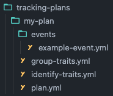

<!--
SPDX-FileCopyrightText: 2022 Gregory Clunies <greg@reflekt-ci.com>

SPDX-License-Identifier: Apache-2.0
-->

# Reflekt
Reflekt is a command line tool (CLI) allowing users to automagically template a dbt package modeling and documenting all the events in a tracking plan from their Analytics Governance tool. These dbt packages can be easily consumed in a dbt project. Each Reflekt dbt package includes:
- A dbt [source](https://docs.getdbt.com/docs/building-a-dbt-project/using-sources) pointing to the schema and tables in the warehouse where raw event data is loaded.
- A dbt [model](https://docs.getdbt.com/docs/building-a-dbt-project/building-models) for each event in the tracking plan. Ready for consumption or further modeling.
- A dbt [doc](https://docs.getdbt.com/docs/building-a-dbt-project/documentation) entry for every model in the package, pulling information directly from the tracking plan. Your dbt docs *reflekt* your tracking plan. The data team and the business always know what your tables and columns mean.

Reflekt integrates with you Analytics Governance tool (e.g. [Segment Protocols](https://segment.com/docs/protocols/), [Avo](https://www.avo.app/)), Customer Data Platform (e.g. [Segment](https://segment.com/)), cloud data warehouse (e.g. [Snowflake](https://www.snowflake.com/)), and [dbt](https://www.getdbt.com/).


Reflekt's dbt package templater is powered by its ability to define tracking plans as `code`, making them an *extensible artifact*, similar to how many tools use dbt's `manifest.json` to power their functionality.

**!!! DEMO VIDEO GOES HERE !!!**

By defining tracking plans as code, they can be developed and managed using software engineer principles (version control, development branches, pull requests & reviews, and CI/CD). This is particularly useful for [Segment Protocols](https://segment.com/docs/protocols/) users. With Reflekt, you can:
- Pull a tracking plan from your Analytics Governance tool, converting it to code.
- Push changes to tracking plan code back to your Analytics Governance Tool, Reflekt handles the conversion.
- Create a new tracking plan defined as code.
- Test tracking plan code for naming conventions and required metadata. All defined by rules in your `reflekt_project.yml`.

## Getting Started
- [Docs](docs/DOCUMENTATION.md/#docs)
  - [Install](docs/DOCUMENTATION.md/#install)
  - [Setup](docs/DOCUMENTATION.md/#setup)
    - [Setting up Reflekt with Avo](docs/DOCUMENTATION.md/#setting-up-reflekt-with-avo)
  - [Commands](docs/DOCUMENTATION.md/#commands)
  - [Reflekt project configuration](docs/DOCUMENTATION.md/#project-configuration)
  - [Tracking plans as `code`](docs/DOCUMENTATION.md/#tracking-plans-as-code)
- [Example Reflekt project](https://github.com/GClunies/patty-bar-reflekt) (used in demo above)

## FAQ
**Q:** **Do I have to use Reflekt to manage my tracking plan(s)? What if I like my Analytics Governance tool and just want to use the dbt templater?**

**A:** Reflekt lets you decide what features you want to use. Here are two examples:
1. Manage your tracking plan in Avo using their branches and environments framework:
   - Pull the plan from Avo into your Reflekt Project with `reflekt pull --name my-plan`.
   - Template dbt packages with `reflekt dbt --name my-plan`. Reference packages in your dbt project.
   - Pull plan changes from Avo and template again as needed using Reflekt.
2. Manage your tracking plan(s) as code in a Reflekt project. Develop and manage plans using software engineer principles (version control, development branches, pull requests & reviews, and CI/CD)
   - Make changes to the tracking plan by changing the tracking plan `code` in Reflekt project repo.
   - Open pull requests in GitHub. Request reviews from team members, debate and collaborate. Run a CI suite using `reflekt test --name my-plan` to test naming conventions and expected metadata.
   - On merge to `main` branch in GitHub, sync changes to Segment Protocols with `reflekt push --name my-plan`.
   - Template dbt packages with `reflekt dbt --name my-plan`. Reference packages in your dbt project.

**Q:** **If the tracking plan is `code`, how can a product manager, marketer, etc. propose changes?**

**A:** This question assumes code is only for engineers - we strongly disagree! *Anyone* can learn how Reflekt defines a tracking plan as code, which is why the code is designed to be *human-readable*. In Reflekt, tracking plans are defined in a `tracking-plans/` folder with each event defined using a simple YAML file.

<details><summary><strong>example-event.yml</strong> (click to expand)</summary><p>

```yaml
# Example 'Product Added' event
- version: 1
  name: Product Added
  description: Fired when a user adds a product to their cart.
  metadata:  # Set event metadata. Configure metadata tests in reflekt_project.yml
    product_owner: pm-name
    code_owner: eng-squad-1
    priority: 1
  properties:
    - name: cart_id
      description: Cart ID to which the product was added to.
      type: string
      required: true    # Specify a property is required
    - name: product_id
      description: Database ID of the product being viewed.
      type: integer
      required: true
    - name: name
      description: Name of the product.
      type: string     # Specify property data type
      required: true
    - name: variant
      description: Variant of the product (e.g. small, medium, large).
      type: string
      enum:            # List of allowed values
        - small
        - medium
        - large
      required: false  # Property is not required
    - name: price
      description: Price ($) of the product added to the cart.
      type: number
      required: true
    - name: quantity
      description: Quantity of the product added to the cart.
      type: integer
      required: true
```
</p></details>



With this simple structure and file format, anyone can be taught to make changes to the tracking code and submit a PR using GitHub's web interface. No terminal or IDE required!

**Q:** **What analytics governance tools does Reflekt support?**

**A:** Reflekt currently supports [Segment Protocols](https://segment.com/docs/protocols/) and [Avo](https://www.avo.app/).

**Q:** **What customer data platforms (CDPs) does Reflekt support?**

**A:** Reflekt currently supports data collected using [Segment](https://segment.com/). Support for [Rudderstack](https://www.rudderstack.com/) is being investigated.

**Q:** **What data warehouses does Reflekt support?**

**A:** Reflekt currently works with [Snowflake](https://www.snowflake.com/) and [Redshift](https://aws.amazon.com/redshift/).

## Reporting bugs
If you want to report a bug or request a feature, please open an [issue](https://github.com/GClunies/reflekt/issues).

## Contributing code
Feel free to open a [Pull Request](https://github.com/GClunies/reflekt/pulls) for contributions you would like to propose. See the [contributing](docs/CONTRIBUTING-CODE.md) docs for development environment details and guidance.
