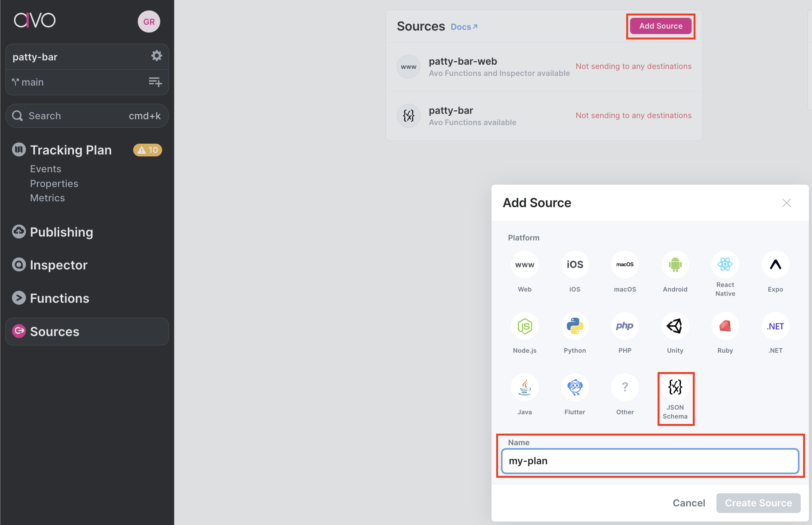
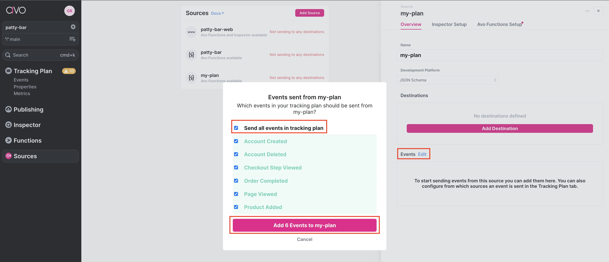
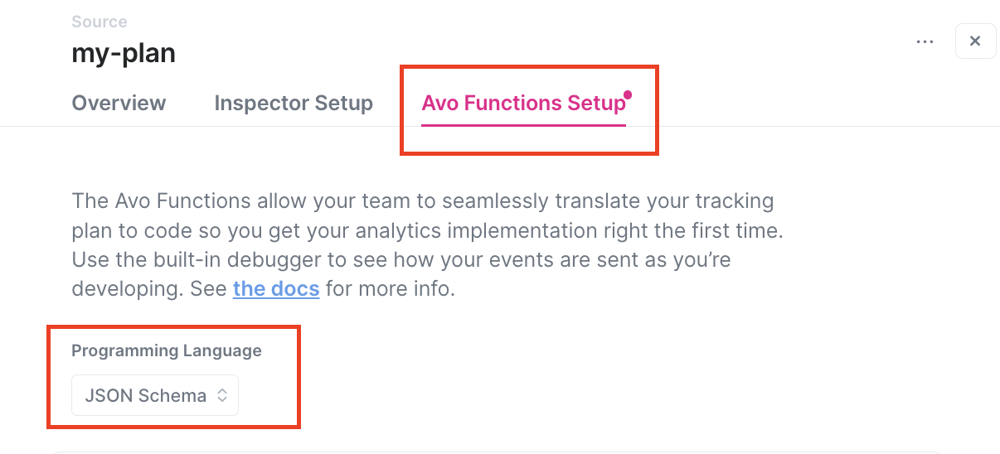
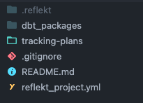

# Reflekt Docs
Documentation to get you started using Reflekt and setting up you project. Where possible, demo videos are included in addition to the written docs.

- [Reflekt Docs](#reflekt-docs)
  - [Install](#install)
  - [Setup](#setup)
    - [Connecting Reflekt + Avo](#connecting-reflekt--avo)
  - [Commands](#commands)
  - [Project configuration](#project-configuration)
    - [Project structure](#project-structure)
    - [Reflekt project](#reflekt-project)
    - [Reflekt profile](#reflekt-profile)
  - [Tracking plans as `code`](#tracking-plans-as-code)
    - [Events](#events)
      - [Event metadata](#event-metadata)
      - [Event properties](#event-properties)
  - [Identify traits](#identify-traits)
  - [Group traits](#group-traits)
  - [Testing & CI](#testing--ci)

## Install
Install Reflekt with `pip`. Installing in a virtual Python environment is recommended.
```bash
$ pip install reflekt
```

## Setup
A step-by-step guide to create your first Reflekt project.

1. Create a git repo or clone one from GitHub.
```bash
# Option 1: Create a Git repo locally
$ mkdir path/to/reflekt-project  # Make a new directory
$ cd path/to/reflekt-project     # Navigate inside directory
$ git init                       # Initialize Git repo

# Option 2: Clone a Git repo from GitHub
$ git clone https://github.com/user/reflekt-project.git
```

2. Initialize a new Reflekt project.
```bash
# Navigate inside repo
$ cd path/to/reflekt-project

# Initialize new Reflekt project and create profile in reflekt_config.yml
$ reflekt init --project-dir .
```

You've created your first Reflekt project! You can configure your Reflekt project in the `reflekt_project.yml`. See the [Project configs](https://github.com/GClunies/reflekt/blob/main/docs/DOCUMENTATION.md#project-configs) docs for details and guidance.


### Connecting Reflekt + Avo
Connecting Reflekt with [Avo](https://www.avo.app/) requires some additional steps. Don't worry, you only need to do this once and is well worth it! Here are the exact steps:

1. Contact Avo using their chat support and request access to the JSON source. They are very responsive!
2. Install Node (recommend using [`nvm`](https://github.com/nvm-sh/nvm)) and Node package manager (`npm`). This follows guidance found in the [npm docs](https://docs.npmjs.com/downloading-and-installing-node-js-and-npm).
   ```bash
   # Install Node version manager
   $ curl -o- https://raw.githubusercontent.com/nvm-sh/nvm/v0.39.1/install.sh | bash
   $ nvm version  # Outputs Node.js version
   v17.8.0

   # Install Node package manager
   $ npm install -g npm
   $ npm -v  # Output npm version
   8.11.0
   ```
3. Install the [Avo CLI](https://www.avo.app/docs/implementation/cli) using `npm`.
   ```bash
   $ npm install -g avo  # Install Avo CLI
   $ avo --version       # Verify install
     2.0.2
   ```
4. Link your Avo Account to the Avo CLI.
   ```bash
   $ avo login   # Link Avo account
   $ avo whoami  # Verify account link
     info Logged in as you@somewhere.com
   ```
5. In a web browser, login to your Avo account and create a JSON Source. The name of the JSON source will be used by Reflekt as the tracking plan name. In the example below, you would pull your tracking plan from Avo by running `reflekt pull --name my-plan`.

   

6. In the settings for the newly created JSON source:
   1. Click `edit` next to **Events** and select `Send all events in tracking plan`. This ensures Reflekt searches for all event data in your warehouse when templating your dbt package(s).

      

   2. Under the **Avo Functions Setup** tab, set the **Programming Language** to `JSON Schema`. You don't need to do anything else on this tab.

      

7. In your Reflekt project, configure Avo with Reflekt
   ```bash
   # From the root of your Reflekt project
   $ cd .reflekt/avo

   $ avo init
     success Initialized for workspace your-avo-workspace-name
     info Run 'avo pull' to pull analytics wrappers from Avo

   $ avo pull --force
     info Pulling from branch 'main'
     info No sources configured.
     # You will be prompted for the following
     # Replace example values inside < > with your values
     ? Select a source to set up
         # Select the Avo JSON source you created
     ? Select a folder to save the analytics wrapper in
         # Select '.'
     ? Select a filename for the analytics wrapper
         # Type <your-avo-json-source>.json

     success Analytics wrapper successfully updated
     └─ your-avo-json-source
        └─ your-avo-json-source.json
   ```

8. Configure your Reflekt project in the `reflekt_project.yml`. See the [Project configs](https://github.com/GClunies/reflekt/blob/main/docs/DOCUMENTATION.md#project-configs) docs.

## Commands

1. Create a Reflekt project.
   ```bash
   $ reflekt init --project-dir ./my_reflekt_project  # Follow the prompts
   ```

2. Get a tracking plan from your Analytics Governance Tool (Segment Protocols, Avo, others coming soon) and convert it to a Reflekt tracking plan code, ready for templating.
   ```bash
   $ reflekt pull --name <plan-name>
   ```

3. Use the Reflekt dbt templater to save your data team time. As your tracking plan changes, re-template to model the changes. Reflekt will bump the version of your dbt package as it evolves with your tracking plan.
   ```bash
   $ reflekt dbt --name <plan-name>
   ```

4. Sync your Reflekt tracking plan to your Analytics Governance tool. Reflekt handles the conversion!
   ```bash
   $ reflekt push --name <plan-name>
   ```
   **NOTE**: `reflekt push` does not support Avo. If you use Avo, we recommend managing your plan there and using `reflekt pull` and `reflekt dbt` to pull your plans and template your dbt models as needed.

5. Test events and properties in your tracking plan for naming conventions, data types, and expected metadata.
   ```zsh
   $ reflekt test --name <plan-name>
   ```

6. Create a new tracking plan, defined as code.
   ```bash
   $ reflekt new --name <plan-name>
   ```

## Project configuration

### Project structure
A Reflekt project is a directory of folders and files that define your tracking plans and any templated dbt packages based on those plans.



### Reflekt project
Every Reflekt project has a `reflekt_project.yml`, setting project wide configurations. Expand the example `reflekt_project.yml`  to see the available parameters and their explanations.

```yaml
# reflekt_project.yml

# Configurations are REQUIRED unless flagged by an '# OPTIONAL (optional_config:)' comment
# Uncomment OPTIONAL configurations to use them

name: example_project

config_profile: example_profile  # Profile defined in reflekt_config.yml

# OPTIONAL (config_path:)
# config_path: /absolute/path/to/reflekt_config.yml  # OPTIONAL

tracking_plans:
  warehouse_schemas:
    # For each tracking plan, specify the schema(s) in data warehouse where
    # Reflekt should look for raw event data. This can be a single schema
    # (e.g. plan-name: schema_name) or a list of schemas (e.g. plan-name: ['schema_one', 'schema_two']).
    # Schema names are used by Reflekt to build dbt package folder and file
    # names when templating dbt packages (e.g. reflekt_schema_name__event_name.sql).
    example-plan: example_schema

  events:
    naming:        # Naming conventions for events
      case: title  # One of title|snake|camel
      allow_numbers: false
      reserved: []  # Reserved event names (casing matters)

    # OPTIONAL (expected_metadata:)
    # Define a schema for expected event metadata. Tested when running:
    #     reflekt test --name <plan-name>
    expected_metadata:
      code_owner:
        required: true
        type: string
        allowed:
          - Jane
          - John
      stakeholder:
        type: string
        allowed:
          - Product
          - Marketing
          - Sales

  properties:
    naming:        # Naming conventions for properties
      case: snake  # One of title|snake|camel
      allow_numbers: false
      reserved: [] # Reserved property names (casing matters)

    data_types: # Allowed property data types. Available types listed below
      - string
      - integer
      - boolean
      - number
      - object
      - array
      - any
      - 'null'  # Specify null type in quotes

dbt:
  templater:
    sources:
      prefix: src_reflekt_       # Prefix for templated dbt package sources

    models:
      prefix: reflekt_           # Prefix for templated dbt package models & docs
      materialized: incremental  # view|incremental
      # OPTIONAL (incremental_logic:) [REQUIRED if 'materialized: incremental']
      # Specify the incremental logic to use when templating dbt models.
      # Must include  ...  block
      incremental_logic: |
        
        where received_at >= ( select max(received_at_tstamp)::date from {{ this }} )
        

```

### Reflekt profile
Similar to dbt's `profiles.yml`, Reflekt uses a `reflekt_config.yml` file with profiles containing connection configurations for your Analytics Governance Tool, CDP, and warehouse. Profiles are configured when you run `reflekt init` to first create your Reflekt project. Two example profiles are provided below.

```yaml
# NOTE: Can have more than one profile in your reflekt_config.yml
# to support multiple Reflekt projects

# Example One
# CDP = Segment
# Analytics Governance tool = Segment Protocols
# Warehouse = Redshift
example_profile_one:
  plan_type: segment  # Plan in Segment Protocols
  cdp: segment
  workspace_name: <your-workspace>  # From https://app.segment.com/your-workspace/overview
  access_token: <your_token>
  warehouse:
    redshift:
      db_name: <your_database>
      host_url: <your_host_url>  # e.g. xxxx.us-west-1.redshift.amazonaws.com
      port: <your_port>          # e.g. 5439
      user: <your_user>          # Recommend creating a reflekt_user
      password: <your_password>

# Example Two
# CDP = Segment
# Analytics Governance tool = Avo
# Warehouse = Snowflake
example_profile_two:
  cdp: segment
  plan_type: avo
  warehouse:
    snowflake:
      account: <your_account>      # e.g. abc1234
      database: <your_database>    # e.g. raw
      user: <your_user>            # Recommend creating a reflekt_user
      password: <your_password>
      role: <your_role>            # e.g. transformer
      warehouse: <your_warehouse>  # e.g. transforming
```

## Tracking plans as `code`
Reflekt manages tracking plans in a `tracking-plans/` directory of the Reflekt project. Your events, identify traits, and group traits all have corresponding YAML files. These YAML files are designed to be ***human-readable*** so that users less comfortable with code can still read and learn to contribute to the code.


### Events
Each event in your tracking plan has its own YAML file, making it easy to manage and update.

<details><summary>Example <code>product-added.yml</code> (click to expand)</summary><p>

```yaml
# product-added.yml
- version: 1
  name: Product Added
  description: Fired when a user adds a product to their cart.
  metadata:  # Set event metadata. Configure metadata tests in reflekt_project.yml
    product_owner: pm-name
    code_owner: eng-squad-1
    priority: 1
  properties:
    - name: cart_id
      description: Cart ID to which the product was added to.
      type: string
      required: true    # Specify property is required
    - name: product_id
      description: Database ID of the product being viewed.
      type: integer
      required: true
    - name: name
      description: Name of the product.
      type: string     # Specify property type
      required: true
    - name: variant
      description: Variant of the product (e.g. small, medium, large).
      type: string
      enum:            # Enumerated list of allowed values
        - small
        - medium
        - large
      required: false  # Property is not required
    - name: price
      description: Price ($) of the product added to the cart.
      type: number
      required: true
    - name: quantity
      description: Quantity of the product added to the cart.
      type: integer
      required: true
```
</p></details>

#### Event metadata
Event metadata, defined using the `metadata:` config (see example event above), can be used to tag events with information not available in the event data itself. Metadata can be whatever you want! Some example use cases are:
- Event `product_owner` (who needs to know if something is wrong)
- Event `code_owner` (who you will fix the code)
- event `priority` (how urgently should we fix an issue?)

Reflekt automatically pulls metadata down from your Analytics Governance tool when running `reflekt pull --name my-plan` using the following logic:
- Segment Protocols -> Segment event "labels" converted to `metadata:`
- Avo -> Avo event "tags" converted to `metadata:`

#### Event properties
Reflekt automatically pulls event properties (see example event above) down from your Analytics Governance tool when running `reflekt pull --name my-plan`.

## Identify traits
Like events, identify calls and their user traits are specified in a YAML file.

<details><summary>Example <code>identify-traits.yml</code> (click to expand)</summary><p>

```yaml
# product-added.yml
traits:
  - name: email
    description: The user's email address.
    type: string
    required: true
  - name: address
    description: The user's mailing address.
    type: string
```
</p></details>

## Group traits
You guessed it, group calls and their group traits are specified in a YAML file too.

<details><summary>Example <code>group-traits.yml</code> (click to expand)</summary><p>

```yaml
# product-added.yml
traits:
  - name: account_name
    description: The account name.
    type: string
    required: true
  - name: is_paying
    description: Does the account pay us?
    type: boolean
```
</p></details>

## Testing & CI
Reflekt allows users to test that the events in their tracking plan code validate against the naming conventions and expected metadata defined in the `reflekt_project.yml`.

This feature is particularly helpful to [Segment Protocols](https://segment.com/docs/protocols/) users who use Reflekt to manage their tracking plan as `code` in a GitHub repo, syncing with Segment as plan changes are merged to the `main` branch.

When a pull request is opened, a CI suite could be triggered to run:
```
$ reflekt test --plan my-plan
21:24:07 Testing Reflekt tracking plan 'my-plan'
21:24:07     Parsing event file account-created.yml
21:24:07     Parsing event file account-deleted.yml
21:24:07     Parsing event file checkout-step-viewed.yml
21:24:08     Parsing event file order-completed.yml
21:24:10     Parsing event file page-viewed.yml
21:24:12     Parsing event file product-added.yml

21:24:14 [PASSED] No errors detected in Reflekt tracking plan 'my-plan'
```

Then, when the pull request and plan changes are merged to the `main` branch, the CI suite can sync changes to Segment.
```bash
$ reflekt push --name my-plan  # Syncs to Segment!
```
